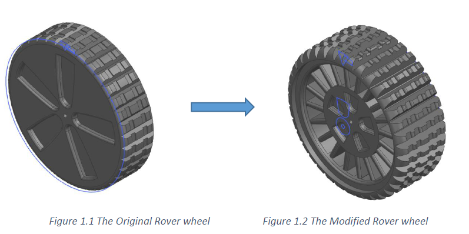
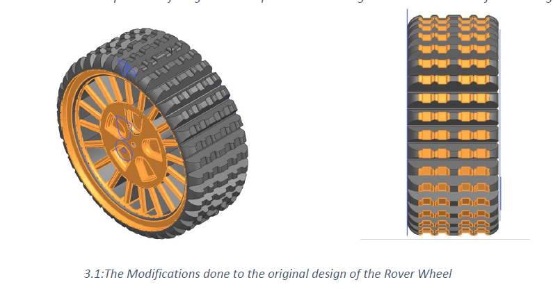
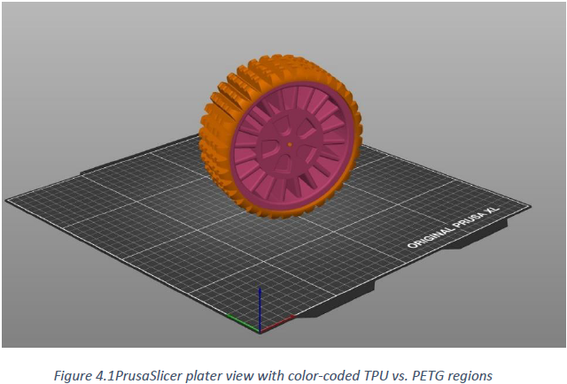
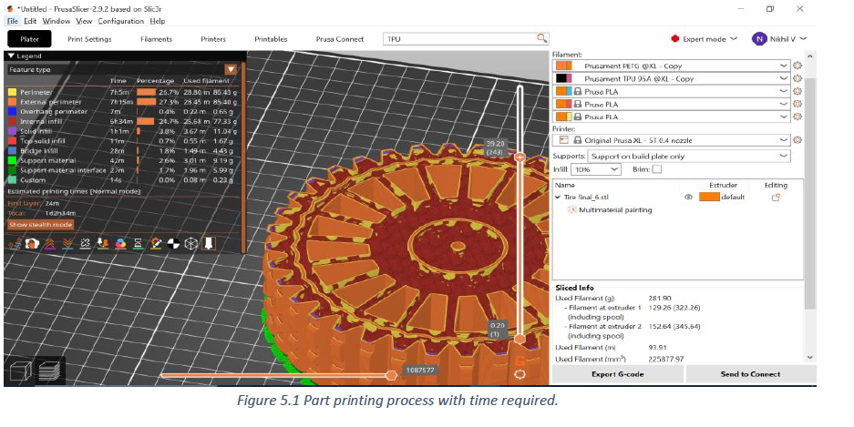

# Additive Manufacturing of Off-Road Tire for Autonomous Rover

**Computer Integrated Manufacturing (CIM) Project | TU Clausthal | SS 2025**
**Team:** Nikhil Vinayagamurthy, Raghav Dixit
**Supervisor:** Prof. Dr. David Inkermann

---

## Project Overview

Redesigned and optimized an existing rover wheel model for **dual-material FDM production** on the Original Prusa XL (5-Tool Multi-Extruder), applying Design for Manufacturability (DfX) principles. The project transforms a solid-disc rover wheel into a high-performance, manufacturable tire combining two materials in a single print job: a **soft, energy-absorbing TPU 95A inner core** for compliance and shock absorption, and a **rigid, wear-resistant PETG outer tread** for traction and durability on loose, uneven terrains such as mud, gravel, and sand.

The redesigned tire was fully modeled in **Siemens NX**, sliced in **PrusaSlicer**, and physically printed as a working prototype — total print time approximately 26 hours.

---

## Objectives

- Optimize an existing rover tire model for FDM manufacturability
- Apply DfX principles: wall thickness, overhangs, support minimization, part consolidation
- Integrate dual-material zoning (TPU 95A / PETG) within a single print job
- Improve off-road traction, compliance, and service life over the original design
- Validate the design through physical prototyping and slicing simulation

---

## Design Approach — DfX Principles Applied

### 1. Minimum Wall Thickness
A minimum wall thickness of **2 mm** is enforced throughout all spokes, rim walls, and connecting fillets, ensuring reliable layer bonding and preventing under-extrusion failures on standard 0.4 mm nozzles.

### 2. Overhang Control
All tread block flanks are limited to **≤ 45° overhang angles**, allowing them to print without external support structures in the outer PETG zone.

### 3. Support Minimization & Build Orientation
Orienting the tire vertically (axis along Z) allows circumferential tread features to build naturally upon previous layers. Only small internal overhangs in the TPU core require supports on the build plate, minimising post-processing work.

### 4. Part Consolidation & Modularity
Tread, spokes, and rim are integrated into a **single CAD model**, eliminating assembly steps and potential joint failures. Dual-material zoning is managed within one print job via tool-change commands at the 130 mm diameter boundary.

---

## Design Optimizations

| Feature | Original Model | Optimized Model | Justification |
|---|---|---|---|
| Spoke Count | Solid disc (0 spokes) | 20 radial spokes (4 mm → 2 mm taper) | Reduces material, improves terrain flexibility |
| Outer Diameter | 150 mm | 150 mm | Retains large contact patch for loose terrain |
| Tread Width | 40 mm | 60 mm (+50%) | Distributes load, reduces ground penetration |
| Lug Depth | 3.9 mm | 8.6 mm | Deeper lug for mud ejection and stronger layer bonds |
| Min Wall Thickness | — | 2 mm (all features) | Ensures reliable extrusion and structural integrity |
| Spoke Taper | — | 4 mm (hub) → 2 mm (mid-radius) | Filleted junction reduces stress concentrations |
| Dual-Material Boundary | Single material | 130 mm diameter (TPU core / PETG shell) | Zone-based material properties in one print |

## Original vs modified

## Spokes overhang

---

## Dual-Material Zoning

| Zone | Material | Diameter Range | Role |
|---|---|---|---|
| Inner core | TPU 95A | 0 – 130 mm | Soft, flexible, energy-absorbing |
| Outer shell + tread | PETG | 130 – 150 mm | Rigid, wear-resistant, high-traction |

The material transition is handled by **tool-change commands at the 130 mm Z-height boundary**, with a wipe tower included in the slicer setup to prevent cross-contamination between filaments.

## Prusa slicer plater

---

## Siemens NX Workflow

1. **Sketch & Feature Updates** — Updated tread sketch to reflect new width and lug profile; updated revolve and pattern features for deeper lugs with modified flank angles
2. **Spoke Redesign** — Adjusted radial spoke command for 4 mm → 2 mm taper; applied 2 mm fillet radii at hub-spoke junctions
3. **Export for Slicing** — STL exported from Siemens NX as a single component; imported into PrusaSlicer as a multi-material composite part preserving the 0–130 mm and 130–150 mm zoning

---

## PrusaSlicer Print Parameters

| Parameter | PETG Outer Shell (Extruder 1) | TPU 95A Inner Shell (Extruder 2) |
|---|---|---|
| Filament Length | 28.45 m | 25.68 m |
| Filament Mass | 129.26 g | 152.64 g |
| Infill Density | 10% | 10% |
| Infill Pattern | Gyroid | Gyroid |
| Layer Height | 0.20 mm | 0.20 mm |
| Nozzle Temperature | 230 °C | 240 °C |
| Bed Temperature | 60 °C | 70 °C |
| Wall Count | 3 | 4 |
| Supports | Build plate only | Build plate only |
| Brim | None | None |

## Print process

**Total Print Time (Normal mode):** 1 day 2 hours 34 minutes
**Total Print Time (Stealth mode):** 1 day 3 hours 8 minutes
**Total Tool Changes:** 248

---

## Prototype & Results

The redesigned tire was successfully printed on the Original Prusa XL as a dual-material FDM part. The physical prototype confirms:

> Dual-material boundary integrity — clean PETG/TPU transition at 130 mm diameter

> 20-spoke radial structure printed without failures

> Deeper lug profile (8.6 mm) fully resolved with correct overhang angles

> 60 mm tread width achieved across the full contact patch

> Part consolidation confirmed — single print job, no assembly required

**Full technical report:** [`CIM_ADDITIVE MANUFACTURING_GROUP 32.pdf`](CIM_ADDITIVE%20MANUFACTURING_GROUP%2032.pdf)

---

## Key Technical Decisions

**Why gyroid infill?** Gyroid is an isotropic infill pattern — it distributes stress equally in all directions, which is critical for a tire that experiences radial, lateral, and torsional loads simultaneously. It also provides a good balance of flexibility and rigidity at 10% infill density.

**Why TPU 95A for the inner core?** Shore 95A TPU offers enough softness to absorb impact and conform to terrain irregularities, while retaining sufficient rigidity to transmit drive torque through the spokes without excessive deformation.

**Why PETG for the outer tread?** PETG provides better abrasion resistance than PLA and higher toughness than standard PETG, with a printable temperature range compatible with the Prusa XL platform. It bonds well to TPU at the material interface under FDM conditions.

---

## Tools & Skills

| Tool | Usage |
|---|---|
| Siemens NX | Parametric CAD modeling, spoke redesign, STL export |
| PrusaSlicer | Multi-material slicing, tool-change configuration, print simulation |
| Original Prusa XL (5T) | Dual-material FDM printing |
| DfX Principles | Wall thickness, overhang, support minimization, consolidation |

---

## Conclusion

The rover tire was successfully redesigned for FDM using Siemens NX, adhering to both mechanical performance and manufacturing constraints. Optimization enhanced off-road capabilities through increased tread width, lug depth, and total tire surface area. Through integration of DfX principles and dual-material slicing in PrusaSlicer, the part was printed as a single consolidated component with improved performance, manufacturability, and structural integrity — ready for deployment on an autonomous rover platform.

---

## References

1. I. Gibson, D. W. Rosen, and B. Stucker, *Additive Manufacturing Technologies*, 3rd ed., CRC Press, 2015.
2. Bridgestone Corporation, "Development of a Non-Pneumatic Off-Road Rover Tire," Bridgestone Technical Report, 2019.
3. Siemens, *NX 12 for Engineering Design* (software documentation).
4. Prusa Research, *PrusaSlicer Documentation*, 2025. [Online]: https://help.prusa3d.com/

---

## Affiliation

**Technische Universität Clausthal**
Institute of Mechanical Engineering
Computer Integrated Manufacturing (CIM) | SS 2025
