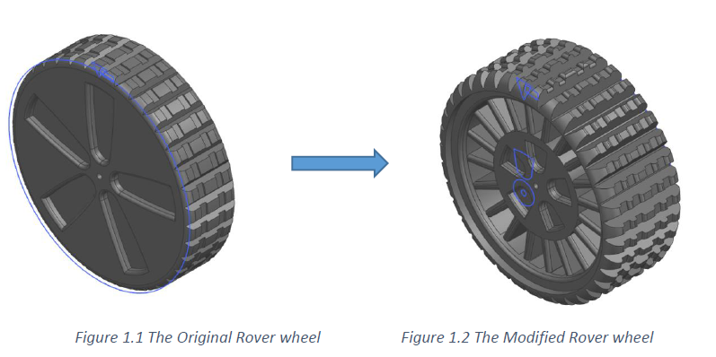
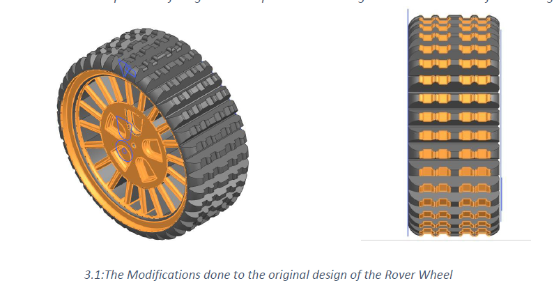
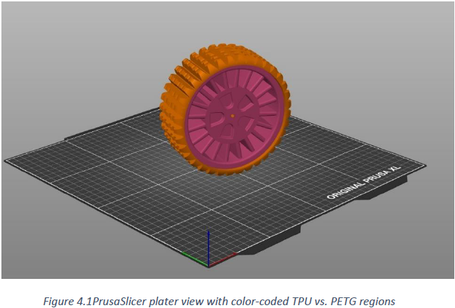
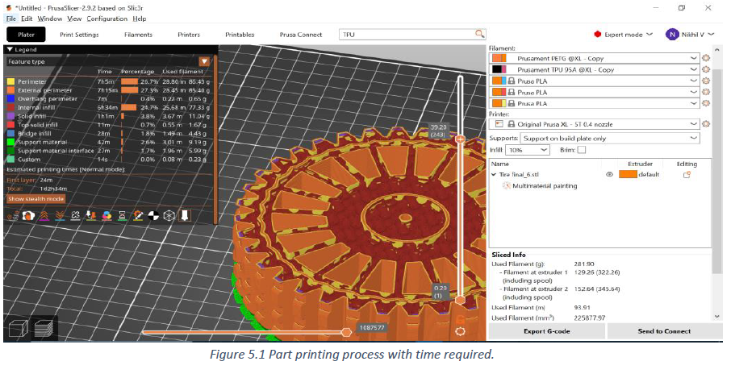

# Rover Tire Optimized for Additive Manufacturing

**Redesign of an off-road rover wheel into a dual-material FDM tire with a TPU 95A core and PETG tread, modelled in Siemens NX and prepared for printing in PrusaSlicer on the Original Prusa XL, using DfAM and DfX rules.**

| | |
|---|---|
| **Course** | Computer Integrated Manufacturing, Institute of Mechanical Engineering, TU Clausthal |
| **Supervisor** | Prof. Dr. David Inkermann |
| **Period** | May 2025 - Jul 2025 |
| **Team** | Nikhil Vinayagamurthy, Raghav Dixit |
| **My role** | Co-designed the NX redesign, the DfX analysis and the PrusaSlicer setup with one teammate |
| **Status** | Design and print preparation complete. The tire is ready to print and has not been printed or tested yet. |

---

## Problem

The original wheel was a solid disc with a narrow, shallow tread. Off-road tires need grip, compliance and durability on mud, gravel and sand. The goal was a tire that combines these properties and can be produced in one dual-material print job on a desktop FDM printer.

## Method

### Design changes in Siemens NX

| Feature | Original | Optimized | Why |
|---|---|---|---|
| Structure | Solid disc | 20 radial spokes, tapered 4 mm to 2 mm | Less material, more radial compliance |
| Outer diameter | 150 mm | 150 mm | Same rover interface |
| Rim diameter | 140 mm | 130 mm | Matches the TPU zone, less PETG |
| Overall width | 40 mm | 60 mm | Spreads the load, less ground sinkage |
| Tread thickness | 10 mm | 20 mm | Durability and load resistance |
| Lug depth | 3.9 mm | 8.6 mm | Traction and mud ejection on soft ground |
| Material zones | One material | TPU 95A core 0 to 130 mm, PETG tread 130 to 150 mm | Shock absorption inside, wear resistance outside |

Tapering the spokes **cut TPU volume by about 30%** while keeping the hub stiff. The hub-spoke junctions have 2 mm fillets to reduce stress concentrations.

### DfAM and DfX rules
- **Minimum wall thickness of 2 mm** on spokes, rim walls and fillets for a 0.4 mm nozzle.
- **Overhangs within 45 degrees** on all lug flanks and spoke-hub transitions, so the PETG tread needs no supports.
- **Build orientation** with the tire axis along Z, so the circumferential features support themselves. Only small internal overhangs in the TPU core need build-plate supports.
- **Part consolidation:** tread, spokes and rim in one model and one print job, with no assembly.

### Dual-material slicing in PrusaSlicer
The NX part was split into two bodies, the TPU core and the PETG tread, exported as STL and set up in PrusaSlicer as one multi-material part on two extruders of the Original Prusa XL. A wipe tower prevents mixing between the materials.

| Setting | PETG tread | TPU 95A core |
|---|---|---|
| Layer height | 0.20 mm | 0.20 mm |
| Infill | 10% gyroid | 10% gyroid |
| Walls | 3 | 4 |
| Nozzle and bed temperature | 230°C and 60°C | 240°C and 70°C |
| Supports | None needed | Build plate only |

PrusaSlicer estimate: 248 tool changes and about 26.5 hours of print time in normal mode.

## Results
- Width increased from **40 to 60 mm** and lug depth from **3.9 to 8.6 mm**.
- **About 30% less TPU volume** through tapered spokes.
- Dual-material slicing prepared, with all overhangs **within 45 degrees**.

### Next steps
- Print the tire on the Original Prusa XL.
- Test grip, load capacity and the bond between TPU and PETG.

Full report: [CIM report](CIM_ADDITIVE%20MANUFACTURING_REPORT.pdf)

## Tools
Siemens NX, PrusaSlicer, Original Prusa XL, TPU 95A, PETG, DfAM, DfX

---
Technische Universität Clausthal | MSc Intelligent Manufacturing
